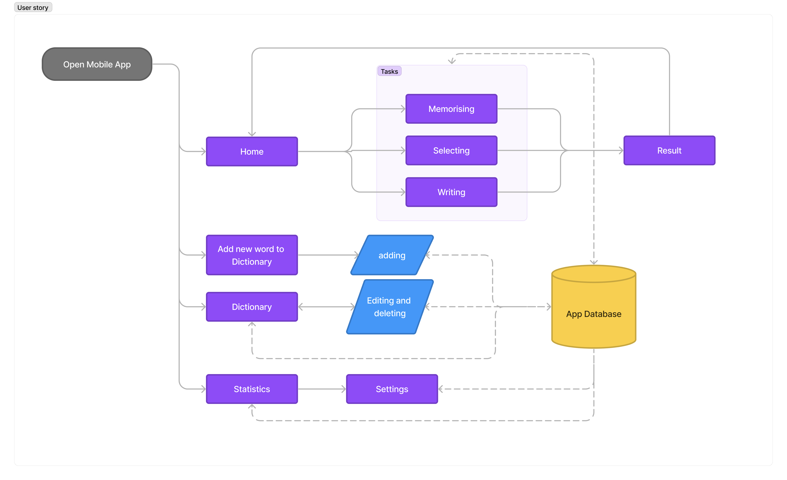

# Echolalia
**Echolalia** - the mobile application designed to help users practice and learn words in a foreign language. Echolalia is built on the principle of repeated repetition and training, making it an effective tool for language learners of all levels.

- [Mockups](https://www.figma.com/file/lT8dzaokxH0heS61JDuYgs/Echolalia?type=design&node-id=0-1&mode=design&t=WjyKi2lYgFPngbiv-0) in Figma
- [Actual screens](./src/screens/)
- [Specification](Specification.pdf)
- [Documentation](Specification.pdf)

## Getting Started
Echolalia is available for both Android and iOS devices. To install the application

- **Android:** 
  - Download `echolalia.apk` file from [GitHub repo](https://github.com/MarkSeliverstov/Echolalia) on your phone and install it.
- **iOS:** 
  - You must have an Apple developer key and you must build release it in VS. Or you can use an emulator in VS.

## Features Overview
Echolalia offers the following key features to facilitate effective language learning:

- **User Profile**: Personalised user profiles and user settings.
- **Dictionary**: Users can add custom words or memorise existing ones.
- **Exercises**: Various exercises are available to test language skills, including memorisation,       - multiple-choice tasks and practicing words using writing.
- **Statistics**: Users can view learning statistics in graphical form, helping them monitor their - progress over time.
- **Settings**: The application offers customisable settings such as changing the language, adjusting exercise word count, and deleting the user account and associated data.

## Project Goals
The primary goals of the Echolalia project include:

- Creating a mobile application for both `Android` and `iOS` platforms using the *Xamarin framework*.
- Creating `backend` for app (Tasks, database model, statistics, settings, dictionary).
- Creating `frontend` for app in Figma and implement it in Xamarin Forms.
