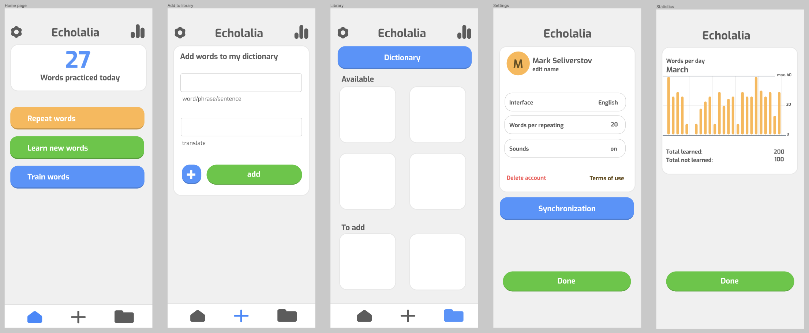

# Echolalia
The application is designed for practice, learning words in a foreign language.  
Echolalia is based on the principle of Echolalia, which is based on repeated repetition and training.

### 1. Created a design for Echolalia in Figma.

### 2. Wrote a specification for Echolalia ([Specification.md](Specification.md))
